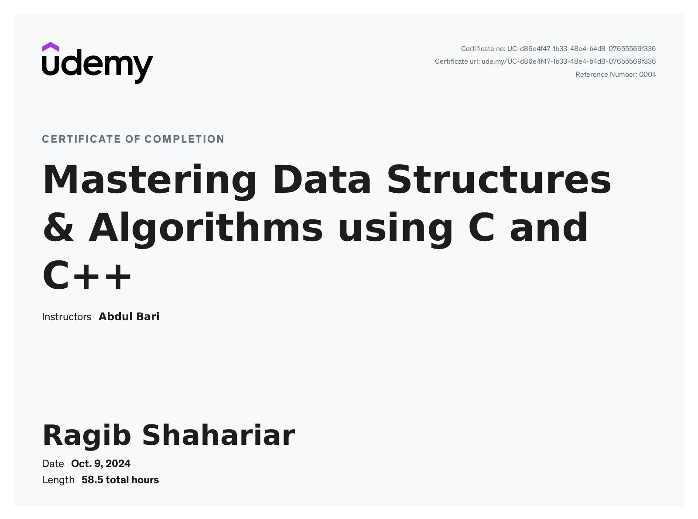

# 👋 Hi, I'm Ragib Shahariar

## 💻 Passionate Programmer | 🎓 Computer Science Student | 🐧 Linux Enthusiast

I'm a dedicated Computer Science and Engineering student at <b>Daffodil International University (DIU)</b>, Bangladesh, with a strong passion for programming and problem-solving. My journey in the world of coding began in 2017, and I've been continuously expanding my skills ever since.

### 🎓 Education
- **Diploma in Computer Engineering**
  - Northern Institute of Science and Technology
  - GPA: 3.89/4.00

- **Learn C++ Programming - Beginner to Advance- Deep Dive in C++** (30.5 hours)
- **Learn JAVA Programming - Beginner to Master** (61.5 hours)
- **Git & GitHub - The Practical Guide** (10.5 hours)
- **Mastering Data Structures & Algorithms using C and C++** (58.5 hours)

### 💼 Skills
- C/C++
- Java
- Data Structures & Algorithms
- HTML/CSS
- SQL
- Git & GitHub
- Linux (Ubuntu, Manjaro)

### 🚀 Interests
- Problem Solving
- Competitive Programming
- Web Development
- Flutter
- Python

### 🐧 Linux Love
I have a strong inclination towards Linux operating systems, with Ubuntu and Manjaro being my favorite distributions. The GNOME desktop environment holds a special place in my heart.

### 🌟 Achievements
- Participated in numerous Programming Contests and Bootcamps
- Completed multiple frontend projects during freelancing courses

### 📚 Learning Journey
My programming journey began with "Computer Programming" by Tamim Shahriar Subeen, a renowned writer in Bangladesh. This C programming book laid the foundation for my passion in coding.

### 🔭 Current Focus
I'm currently expanding my skills in Flutter and Python while continuing to hone my problem-solving abilities through competitive programming.

---

💡 I'm always eager to collaborate on interesting projects and learn new technologies. Feel free to reach out if you'd like to connect or work together!

### 🏆 Certifications

  
  
  
  
  <!-- Add more certificates as needed -->

